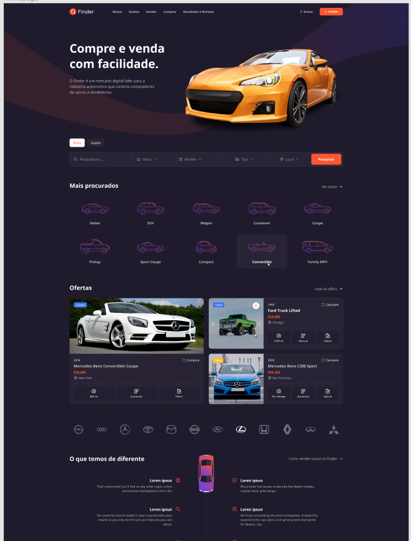

# Car Finder (Grupo 1)

Car Finder, um projeto acadêmico que foi executado no programa Acelerra iCarros_tech, um programa de aceleração de carreiras promovida pela Gama Academy, em parceria com a Icarros (Itaú-Unibanco).

## Tecnologias Utilizadas para esse projeto

Esse projeto foi desenvolvido com as seguintes tecnologias:

- HTML
- CSS
- JavaScript

E pode ser acessado através do link [desse link](https://finderv1.vercel.app/).

## Layout (Figma)

Acesse o layout aqui [desse link](https://www.figma.com/file/FnTOK15dbxgyBC2JqTMEpy/E-carros?node-id=5762%3A29121x).

## API utilizada:

Link de acesso a API [desse link](https://e-carros-api.herokuapp.com/).

## Bord de tarefas (Trello)

Bord de tarefas [desse link](https://trello.com/b/zp1URcPR/kanban).
